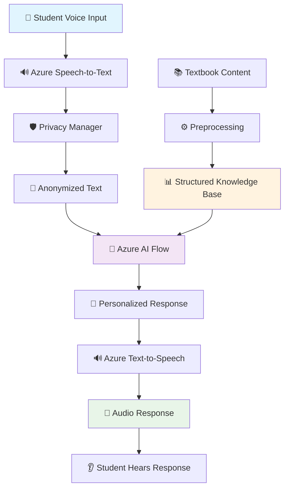

# 🤖 CHIPPY - AI Tutoring Robot

<div align="center">


[](https://python.org)
[](https://azure.microsoft.com)
[](LICENSE)

**An intelligent voice-enabled AI tutoring robot that provides personalized math education for students K-8**

[🚀 Quick Start](#-quick-start) • [📊 Data Flow](#-data-flow) • [🛠️ Setup](#️-setup) • [💬 Usage](#-usage) • [🏗️ Architecture](#️-architecture)

</div>

---

## 🌟 What is CHIPPY?

CHIPPY is an advanced AI-powered tutoring robot designed to revolutionize math education through natural voice interactions. Using cutting-edge Azure Cognitive Services and intelligent conversation flows, CHIPPY provides:

- 🎤 **Voice-First Learning**: Natural speech recognition and synthesis
- 🧠 **Intelligent Tutoring**: AI-powered responses tailored to student needs
- 📚 **Curriculum Aligned**: Covers K-8 math standards (California Common Core)
- 🔒 **Privacy-First**: Built-in anonymization for student data protection
- 📱 **Interactive**: Real-time voice conversations with immediate feedback

---

## 🚀 Quick Start

```bash
# Clone the repository
git clone https://github.com/apex-tutoring-robot/Ai-Agent.git
cd Ai-Agent

# Set up virtual environment
python3 -m venv azure-venv
source azure-venv/bin/activate  # On Windows: azure-venv\Scripts\activate

# Install dependencies
pip install -r requirements.txt

# Set up environment variables
cp azure-speech-to-text/.env.example azure-speech-to-text/.env
# Edit .env with your Azure credentials

# Run CHIPPY
cd azure-speech-to-text/src
python copy_voice_interaction_demo.py
```

---

## 📊 Data Flow



### Data Processing Pipeline

1. **🎤 Audio Capture**: Student speaks into microphone
2. **🔊 Speech Recognition**: Azure Speech-to-Text converts audio to text
3. **🛡️ Privacy Protection**: PrivacyManager anonymizes personal information
4. **🧠 AI Processing**: Azure Flow processes the anonymized query
5. **📚 Knowledge Retrieval**: System accesses relevant curriculum content
6. **🎯 Response Generation**: AI generates personalized tutoring response
7. **🔊 Speech Synthesis**: Azure Text-to-Speech converts response to audio
8. **👂 Audio Playback**: Student hears the tutoring response

---

## 🛠️ Setup

### Prerequisites
- 🐍 Python 3.9+
- 🎤 Microphone and speakers/headphones
- ☁️ Azure Cognitive Services account
- 🔑 Azure Speech Services API key

### 1. Azure Services Setup

1. **Create Azure Cognitive Services Resource**:
   - Go to [Azure Portal](https://portal.azure.com)
   - Create a new "Speech" resource
   - Note your `API Key` and `Region`

2. **Azure AI Flow Setup** (Optional for advanced features):
   - Set up Azure Machine Learning workspace
   - Deploy your flow endpoint
   - Get the endpoint URL and API key

### 2. Environment Configuration

Create your environment file:
```bash
cp azure-speech-to-text/.env.example azure-speech-to-text/.env
```

Edit `.env` with your credentials:
```env
# Azure Speech Services
AZURE_SPEECH_KEY=your_speech_api_key_here
AZURE_SPEECH_REGION=your_region_here

# Azure Flow (Optional)
FLOW_ENDPOINT=your_flow_endpoint_url
FLOW_API_KEY=your_flow_api_key

# Session Configuration
SESSION_ID_PREFIX=CHIPPY_
```

### 3. Install Dependencies

```bash
# Create and activate virtual environment
python3 -m venv azure-venv
source azure-venv/bin/activate

# Install required packages
pip install -r requirements.txt

# For Linux users - install PyAudio dependencies
sudo apt-get install python3-pyaudio portaudio19-dev
```

---

## 💬 Usage

### Basic Voice Interaction

```bash
cd azure-speech-to-text/src
python copy_voice_interaction_demo.py
```

**What you'll see:**
```
🎤 CHIPPY Voice Interaction Demo
✅ Speech services initialized successfully!
🎧 Listening... (Press Ctrl+C to stop)

🎤 Recording... Speak now!
🔊 You said: "What is 5 plus 3?"
🤖 CHIPPY: "5 plus 3 equals 8. Great question! Addition is when we combine numbers to find their total..."
🎵 Playing audio response...
```

### Textbook Processing

Process educational content for CHIPPY's knowledge base:

```bash
python preprocess_textbooks.py
```

This will:
- 📖 Extract text from PDF textbooks
- 🏗️ Structure content by grade level
- 💾 Generate JSON knowledge files
- 📊 Create searchable content database

### Testing Individual Components

```bash
# Test speech recognition only
cd azure-speech-to-text/tests
python test_speech_client.py

# Test privacy management
python test_privacy_manager.py
```

---

## 🏗️ Architecture

### Project Structure
```
Ai-Agent/
├── 🎤 azure-speech-to-text/          # Core voice interaction system
│   ├── src/
│   │   ├── 🗣️ speech_client.py       # Speech recognition
│   │   ├── 🔊 tts_client.py          # Text-to-speech
│   │   ├── 🌐 rest_speech_client.py  # REST API client
│   │   ├── 🛡️ privacy_manager.py     # Data anonymization
│   │   ├── ⚙️ config.py              # Configuration management
│   │   ├── 🎮 copy_voice_interaction_demo.py  # Main demo
│   │   └── utils/
│   │       ├── 🎵 audio_helper.py    # Audio utilities
│   │       └── 🔄 audio_converter.py # Format conversion
│   └── tests/                        # Unit tests
├── 📚 textbooks/                     # Source educational materials
├── 📖 processed_textbooks/           # Extracted text content
├── 📊 processed_json_textbooks/      # Structured knowledge base
├── ⚙️ preprocess_textbooks.py        # Content processing
└── 📋 requirements.txt               # Dependencies
```

### Core Components

#### 🎤 Speech Recognition (`speech_client.py`)
- Real-time audio capture
- Azure Speech-to-Text integration
- Noise filtering and audio optimization

#### 🔊 Text-to-Speech (`tts_client.py`)
- Natural voice synthesis
- Multiple voice options
- Audio format optimization

#### 🛡️ Privacy Manager (`privacy_manager.py`)
- PII detection and anonymization
- Session-based data protection
- Secure data handling

#### 🧠 AI Flow Integration
- Intelligent response generation
- Context-aware conversations
- Personalized tutoring strategies

---

## 🎯 Features

### 🎤 Voice Interaction
- **Real-time Speech Recognition**: Converts student speech to text instantly
- **Natural Voice Responses**: High-quality text-to-speech with human-like intonation
- **Multi-language Support**: Configurable for different languages and accents

### 🧠 Intelligent Tutoring
- **Adaptive Learning**: Adjusts difficulty based on student responses
- **Curriculum Alignment**: Follows K-8 math standards
- **Contextual Understanding**: Maintains conversation context across interactions

### 🔒 Privacy & Security
- **Data Anonymization**: Removes personally identifiable information
- **Session Management**: Secure session handling
- **Local Processing**: Minimizes cloud data transmission

### 📚 Content Management
- **Curriculum Processing**: Extracts and structures educational content
- **Grade-Level Organization**: Content organized by grade levels (K-8)
- **Searchable Knowledge Base**: Quick access to relevant educational material

---

## 🔧 Configuration

### Audio Settings
```python
# In config.py
AUDIO_CONFIG = {
    'sample_rate': 16000,
    'channels': 1,
    'chunk_size': 1024,
    'format': 'wav'
}
```

### Speech Recognition
```python
SPEECH_CONFIG = {
    'language': 'en-US',
    'profanity_filter': True,
    'enable_dictation': True
}
```

### Privacy Settings
```python
PRIVACY_CONFIG = {
    'anonymize_names': True,
    'hash_identifiers': True,
    'session_timeout': 3600  # 1 hour
}
```

---

## 🧪 Testing

Run the test suite:
```bash
cd azure-speech-to-text
python -m pytest tests/ -v
```

Individual test categories:
```bash
# Test speech recognition
python -m pytest tests/test_speech_client.py -v

# Test privacy features
python -m pytest tests/test_privacy_manager.py -v

# Test audio processing
python -m pytest tests/test_audio_helper.py -v
```

---

## 🤝 Contributing

We welcome contributions!

1. 🍴 Fork the repository
2. 🌿 Create a feature branch (`git checkout -b feature/amazing-feature`)
3. 💾 Commit your changes (`git commit -m 'Add amazing feature'`)
4. 📤 Push to the branch (`git push origin feature/amazing-feature`)
5. 🔄 Open a Pull Request

---

## 🆘 Troubleshooting


**🔑 Authentication errors**
- Verify your Azure credentials in `.env`
- Check that your Azure subscription is active
- Ensure the Speech service is available in your region

**🔊 Audio playback issues**
- Check system volume and audio output device
- Verify audio format compatibility
- Test with different TTS voice options

---

## 📞 Support

- 💬 Discord: You know where to find us
- 🐛 Issues: [GitHub Issues](https://github.com/apex-tutoring-robot/Ai-Agent/issues)

---

<div align="center">

**🌟 Star us on GitHub if CHIPPY helps with your educational technology projects! 🌟**

Made with ❤️ by the CHIPPY Team

</div>
```
