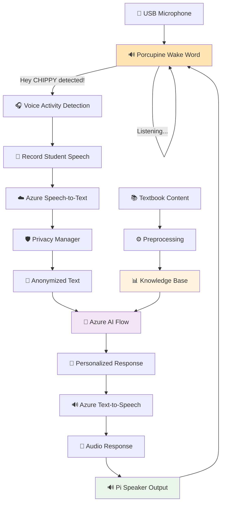

# 🤖 CHIPPY - AI Tutoring Robot

<div align="center">


[](https://python.org)
[](https://azure.microsoft.com)
[](https://picovoice.ai)
[](LICENSE)

**An intelligent voice-enabled AI tutoring robot with wake word detection that provides personalized math education for students K-8**

[🚀 Quick Start](#-quick-start) • [📊 Data Flow](#-data-flow) • [🛠️ Setup](#️-setup) • [💬 Usage](#-usage) • [🏗️ Architecture](#️-architecture)

</div>

---

## 🌟 What is CHIPPY?

CHIPPY is an advanced AI-powered tutoring robot designed to revolutionize math education through natural voice interactions. Optimized for Raspberry Pi deployment, CHIPPY uses cutting-edge Azure Cognitive Services, local wake word detection, and intelligent conversation flows to provide:

- 🎤 **Voice-First Learning**: Natural speech recognition and synthesis
- 🔊 **Wake Word Detection**: Activates on "Hey CHIPPY" - no button needed!
- 🔄 **Continuous Listening**: Always ready to help with Voice Activity Detection (VAD)
- 🧠 **Intelligent Tutoring**: AI-powered responses tailored to student needs
- 📚 **Curriculum Aligned**: Covers K-8 math standards (California Common Core)
- 🔒 **Privacy-First**: Built-in anonymization for student data protection
- 🍓 **Raspberry Pi Ready**: Optimized for Pi 4 with 4GB RAM
- ⚡ **Low Latency**: Local wake word detection for instant response

---

## 🚀 Quick Start

### For Raspberry Pi Deployment

```bash
# Clone the repository
git clone https://github.com/apex-tutoring-robot/Ai-Agent.git
cd Ai-Agent

# Set up virtual environment
python3 -m venv azure-venv
source azure-venv/bin/activate

# Install dependencies
pip install -r requirements.txt

# For Raspberry Pi - install audio dependencies
sudo apt-get update
sudo apt-get install -y python3-pyaudio portaudio19-dev alsa-utils

# Set up environment variables
cp azure-speech-to-text/.env.example azure-speech-to-text/.env
# Edit .env with your credentials (Azure + Porcupine)

# Run CHIPPY with wake word detection
cd azure-speech-to-text/src
python chippy_with_wake_word.py
```

### For Development/Testing

```bash
# Run demo with pre-recorded audio
cd azure-speech-to-text/src
python copy_voice_interaction_demo.py

# Test continuous listening (without wake word)
python pi_voice_loop.py

# Test wake word detection only
python chippy_with_wake_word.py --test-wake-word
```

---

## 📊 Data Flow

### With Wake Word Detection (Production Mode)



### Data Processing Pipeline

1. **🔊 Wake Word Detection**: Porcupine continuously listens for "Hey CHIPPY" (local, ~3% CPU)
2. **🎤 Audio Capture**: When wake word detected, VAD captures student speech
3. **☁️ Speech Recognition**: Azure Speech-to-Text converts audio to text
4. **🛡️ Privacy Protection**: PrivacyManager anonymizes personal information
5. **🧠 AI Processing**: Azure Flow processes the anonymized query
6. **📚 Knowledge Retrieval**: System accesses relevant curriculum content
7. **🎯 Response Generation**: AI generates personalized tutoring response
8. **🔊 Speech Synthesis**: Azure Text-to-Speech converts response to audio
9. **🔈 Audio Playback**: Student hears response through Pi speaker
10. **🔄 Loop**: Returns to wake word listening state

---

## 🛠️ Setup

### Prerequisites

#### Hardware
- 🍓 **Raspberry Pi 4** (4GB RAM recommended) or any Linux system
- 🎤 **USB Microphone** for audio input
- 🔊 **Speaker** (3.5mm jack or HDMI audio)
- 💾 **16GB+ SD Card** with Raspberry Pi OS

#### Software
- 🐍 **Python 3.9+**
- ☁️ **Azure Cognitive Services** account
- 🔑 **Picovoice Porcupine** account (free tier available)

---

### 1. Azure Services Setup

1. **Create Azure Cognitive Services Resource**:
   - Go to [Azure Portal](https://portal.azure.com)
   - Create a new "Speech" resource
   - Note your `API Key` and `Region`

2. **Azure AI Flow Setup**:
   - Set up Azure Machine Learning workspace
   - Deploy your flow endpoint
   - Get the endpoint URL and API key

---

### 2. Porcupine Wake Word Setup

1. **Get Access Key**:
   - Go to [Picovoice Console](https://console.picovoice.ai/)
   - Sign up for free account
   - Copy your Access Key

2. **Train Custom Wake Word** (Recommended):
   - In Picovoice Console, go to **Porcupine**
   - Click **Train Custom Wake Word**
   - Enter phrase: `Hey CHIPPY`
   - Select platform: `Raspberry Pi` (or `Linux`)
   - Train and download `.ppn` file
   - Save to: `azure-speech-to-text/wake_words/Hey-Chippy_en_raspberry-pi_v3_0_0.ppn`

---

### 3. Environment Configuration

Create your environment file:
```bash
cd azure-speech-to-text
cp .env.example .env
nano .env
```

Edit `.env` with your credentials:
```env
# Azure Speech Services
AZURE_SPEECH_KEY=your_speech_api_key_here
AZURE_SPEECH_REGION=your_region_here

# Azure Flow
FLOW_ENDPOINT=your_flow_endpoint_url
FLOW_API_KEY=your_flow_api_key

# Porcupine Wake Word Detection
PORCUPINE_ACCESS_KEY=your_porcupine_access_key_here

# Voice Activity Detection (VAD) Configuration
VAD_SILENCE_THRESHOLD=0.015      # Lower = more sensitive
VAD_SILENCE_DURATION=2.0         # Seconds of silence to end recording
VAD_MIN_SPEECH_DURATION=0.5      # Minimum speech length to process
VAD_PRE_BUFFER=0.3               # Pre-record buffer (seconds)

# Session Configuration
SESSION_ID_PREFIX=CHIPPY_
```

---

### 4. Install Dependencies

```bash
# Create and activate virtual environment
python3 -m venv azure-venv
source azure-venv/bin/activate

# Install required packages
pip install -r requirements.txt

# For Raspberry Pi - install system audio dependencies
sudo apt-get update
sudo apt-get install -y python3-pyaudio portaudio19-dev alsa-utils libasound2-dev
```

---

## 💬 Usage

### 🎯 Production Mode (with Wake Word)

**Primary mode for Raspberry Pi deployment:**

```bash
cd azure-speech-to-text/src

# Run with default microphone
python chippy_with_wake_word.py

# Or specify USB microphone device
python chippy_with_wake_word.py --device 2
```

**Interaction Flow:**
1. Say: **"Hey CHIPPY"**
2. Wait for activation sound/message
3. Ask your question: **"What is 5 plus 3?"**
4. CHIPPY responds with audio
5. Returns to listening for wake word

---

### 🔧 Testing & Development

#### List Available Audio Devices
```bash
cd azure-speech-to-text/src
python chippy_with_wake_word.py --list-devices
```

#### Test Wake Word Detection Only
```bash
python chippy_with_wake_word.py --test-wake-word
```

#### Test Continuous Listening (No Wake Word)
```bash
python pi_voice_loop.py
```

#### Test Logic Without Audio Hardware (WSL/Development)
```bash
python test_logic_only.py
```

#### Test Audio Hardware
```bash
python test_pi_audio.py
```

---

### 📚 Textbook Processing

Process educational content for CHIPPY's knowledge base:

```bash
python preprocess_textbooks.py
```

This will:
- 📖 Extract text from PDF textbooks
- 🏗️ Structure content by grade level
- 💾 Generate JSON knowledge files
- 📊 Create searchable content database

---

### 🎮 Demo Mode (File-based)

For testing with pre-recorded audio:

```bash
cd azure-speech-to-text/src
python copy_voice_interaction_demo.py
```

---

## 🏗️ Architecture

### Project Structure
```
Ai-Agent/
├── 🎤 azure-speech-to-text/          # Core voice interaction system
│   ├── src/
│   │   ├── 🗣️ speech_client.py       # Speech recognition (SDK)
│   │   ├── 🌐 rest_speech_client.py  # Speech recognition (REST)
│   │   ├── 🔊 tts_client.py          # Text-to-speech
│   │   ├── 🎙️ continuous_listener.py # Voice Activity Detection
│   │   ├── 🔔 wake_word_detector.py  # Porcupine wake word wrapper
│   │   ├── 🛡️ privacy_manager.py     # Data anonymization
│   │   ├── ⚙️ config.py              # Configuration management
│   │   ├── 🤖 chippy_with_wake_word.py  # Main: Wake word + continuous
│   │   ├── 🔄 pi_voice_loop.py       # Continuous listening (no wake word)
│   │   ├── 🎮 copy_voice_interaction_demo.py  # Demo with files
│   │   ├── 🧪 test_logic_only.py     # Test without audio hardware
│   │   ├── 🔊 test_pi_audio.py       # Test audio I/O
│   │   └── utils/
│   │       ├── 🎵 audio_helper.py    # Audio utilities
│   │       └── 🔄 audio_converter.py # Format conversion
│   ├── wake_words/                   # Custom .ppn wake word files
│   └── tests/                        # Unit tests
├── 📚 textbooks/                     # Source educational materials
├── 📖 processed_textbooks/           # Extracted text content
├── 📊 processed_json_textbooks/      # Structured knowledge base
├── ⚙️ preprocess_textbooks.py        # Content processing
└── 📋 requirements.txt               # Dependencies
```

---

### Core Components

#### 🔔 Wake Word Detector (`wake_word_detector.py`)
- Picovoice Porcupine integration
- Custom "Hey CHIPPY" wake word detection
- Low CPU usage (~3-5%) for continuous listening
- Configurable sensitivity

#### 🎙️ Continuous Listener (`continuous_listener.py`)
- Voice Activity Detection (VAD)
- Automatic speech start/stop detection
- Pre-speech buffering
- Configurable silence thresholds

#### 🎤 Speech Recognition (`rest_speech_client.py`)
- Azure Speech-to-Text integration (REST API)
- Real-time audio processing
- Noise filtering and optimization
- Retry logic with exponential backoff

#### 🔊 Text-to-Speech (`tts_client.py`)
- Natural voice synthesis
- Multiple voice options (currently: Davis Neural)
- Optimized for Raspberry Pi playback (ALSA)
- Audio format optimization

#### 🛡️ Privacy Manager (`privacy_manager.py`)
- PII detection and anonymization
- Session-based data protection
- Secure data handling

#### 🧠 AI Flow Integration
- Intelligent response generation
- Context-aware conversations
- Personalized tutoring strategies

---

## 🎯 Features

### 🔊 Wake Word Detection
- **"Hey CHIPPY" Activation**: Natural hands-free interaction
- **Local Processing**: Runs on-device, no cloud needed for wake word
- **Low Power**: Only 3-5% CPU usage while listening
- **Customizable**: Train your own wake phrase
- **High Accuracy**: Picovoice Porcupine industry-grade detection

### 🎤 Voice Interaction
- **Continuous Listening**: Always ready after wake word
- **Voice Activity Detection**: Smart speech start/stop detection
- **Real-time Processing**: Low latency speech recognition
- **Natural Responses**: High-quality TTS with human-like intonation
- **Multi-turn Conversations**: Context maintained across interactions

### 🧠 Intelligent Tutoring
- **Adaptive Learning**: Adjusts difficulty based on student responses
- **Curriculum Alignment**: Follows K-8 math standards
- **Contextual Understanding**: Maintains conversation context
- **Personalized Feedback**: Tailored to individual student needs

### 🔒 Privacy & Security
- **Data Anonymization**: Removes personally identifiable information
- **Session Management**: Secure session handling
- **Local Wake Word**: No voice data sent until wake word detected
- **Minimal Cloud Data**: Only active speech sent to Azure

### 🍓 Raspberry Pi Optimized
- **Efficient Resource Usage**: ~60MB RAM, 10-15% CPU during interaction
- **ALSA Audio Support**: Direct Pi speaker/mic integration
- **USB Microphone Support**: Plug-and-play compatibility
- **Low Latency**: Optimized for embedded systems

### 📚 Content Management
- **Curriculum Processing**: Extracts and structures educational content
- **Grade-Level Organization**: K-8 content structure
- **Searchable Knowledge Base**: Quick access to relevant material

---

## 🔧 Configuration

### Wake Word Settings
```python
# In .env file
PORCUPINE_ACCESS_KEY=your_key_here
PORCUPINE_SENSITIVITY=0.5  # 0.0 to 1.0 (higher = more sensitive)
```

### Voice Activity Detection (VAD)
```python
# In .env file
VAD_SILENCE_THRESHOLD=0.015      # RMS threshold (lower = more sensitive)
VAD_SILENCE_DURATION=2.0         # Seconds of silence to end recording
VAD_MIN_SPEECH_DURATION=0.5      # Minimum speech length to process
VAD_PRE_BUFFER=0.3               # Seconds to capture before speech start
```

### Audio Settings
```python
# In config.py
AUDIO_CONFIG = {
    'sample_rate': 16000,
    'channels': 1,
    'chunk_size': 1024,
    'format': 'wav'
}
```

### Speech Recognition
```python
SPEECH_CONFIG = {
    'language': 'en-US',
    'profanity_filter': True,
    'enable_dictation': True
}
```

### Privacy Settings
```python
PRIVACY_CONFIG = {
    'anonymize_names': True,
    'hash_identifiers': True,
    'session_timeout': 3600  # 1 hour
}
```

---

## 🧪 Testing

### Test Checklist (Before Pi Deployment)

```bash
cd azure-speech-to-text/src

# 1. Test Azure credentials
python test_logic_only.py

# 2. List audio devices
python chippy_with_wake_word.py --list-devices

# 3. Test wake word detection
python chippy_with_wake_word.py --test-wake-word

# 4. Test full system
python chippy_with_wake_word.py
```

### Unit Tests
```bash
cd azure-speech-to-text
python -m pytest tests/ -v
```

Individual test categories:
```bash
# Test speech recognition
python -m pytest tests/test_speech_client.py -v

# Test privacy features
python -m pytest tests/test_privacy_manager.py -v
```

---

## ⚙️ Deployment

### Raspberry Pi Setup

1. **Flash Raspberry Pi OS** (64-bit recommended)
2. **Enable SSH** for remote access
3. **Configure Audio**:
   ```bash
   # Test speaker
   speaker-test -t wav -c 2
   
   # Test microphone
   arecord -d 5 test.wav
   aplay test.wav
   ```
4. **Clone and Setup** (follow Quick Start)
5. **Auto-start on Boot** (optional):
   ```bash
   # Add to /etc/rc.local
   cd /home/pi/Ai-Agent/azure-speech-to-text/src
   /home/pi/Ai-Agent/azure-venv/bin/python chippy_with_wake_word.py &
   ```

---

## 🆘 Troubleshooting

### Wake Word Issues

**Wake word not detecting:**
- Check microphone is working: `arecord -d 5 test.wav && aplay test.wav`
- Adjust sensitivity: Increase `PORCUPINE_SENSITIVITY` in `.env`
- Verify access key is correct
- Train custom wake word at [Picovoice Console](https://console.picovoice.ai/)

**False activations:**
- Lower `PORCUPINE_SENSITIVITY` (try 0.3-0.4)
- Ensure .ppn file matches your platform (Raspberry Pi vs Linux)

### Audio Issues

**Microphone not found:**
- List devices: `python chippy_with_wake_word.py --list-devices`
- Specify device: `python chippy_with_wake_word.py --device 2`
- Check USB connection

**No audio output:**
- On Pi: `sudo apt-get install alsa-utils`
- Test: `speaker-test -t wav -c 2`
- Select correct output: `raspi-config` → Audio

### VAD Issues

**Speech cut off too early:**
- Increase `VAD_SILENCE_DURATION` (try 3.0 seconds)
- Lower `VAD_SILENCE_THRESHOLD` (try 0.01)

**Not detecting speech:**
- Lower `VAD_SILENCE_THRESHOLD` (try 0.02-0.03)
- Check microphone levels

### Azure Issues

**Authentication errors:**
- Verify credentials in `.env`
- Check Azure subscription is active
- Ensure Speech service available in your region

**Timeout errors:**
- Check internet connection
- Verify firewall isn't blocking Azure endpoints

---

## 📊 Performance Metrics

### Raspberry Pi 4 (4GB RAM)

| State | CPU Usage | RAM Usage | Notes |
|-------|-----------|-----------|-------|
| **Wake Word Listening** | 3-5% | ~20MB | Idle state, waiting for "Hey CHIPPY" |
| **Speech Recording** | 8-12% | ~50MB | VAD active, recording user speech |
| **Azure Processing** | 2-5% | ~60MB | Network calls to Azure APIs |
| **TTS Playback** | 5-8% | ~40MB | Playing response audio |
| **Peak Usage** | ~15% | ~80MB | During full interaction cycle |

**Total:** Comfortable operation on Pi 4GB with plenty of headroom for additional features!

---

## 🤝 Contributing

We welcome contributions!

1. 🍴 Fork the repository
2. 🌿 Create a feature branch (`git checkout -b feature/amazing-feature`)
3. 💾 Commit your changes (`git commit -m 'Add amazing feature'`)
4. 📤 Push to the branch (`git push origin feature/amazing-feature`)
5. 🔄 Open a Pull Request

---

## 📞 Support

- 💬 Discord: You know where to find us
- 🐛 Issues: [GitHub Issues](https://github.com/apex-tutoring-robot/Ai-Agent/issues)

---

## 📜 License

This project is licensed under the MIT License.

---

<div align="center">

**🌟 Star us on GitHub if CHIPPY helps with your educational technology projects! 🌟**

Made with ❤️ by the CHIPPY Team

**Powered by:** Azure Cognitive Services • Picovoice Porcupine • Raspberry Pi

</div>

